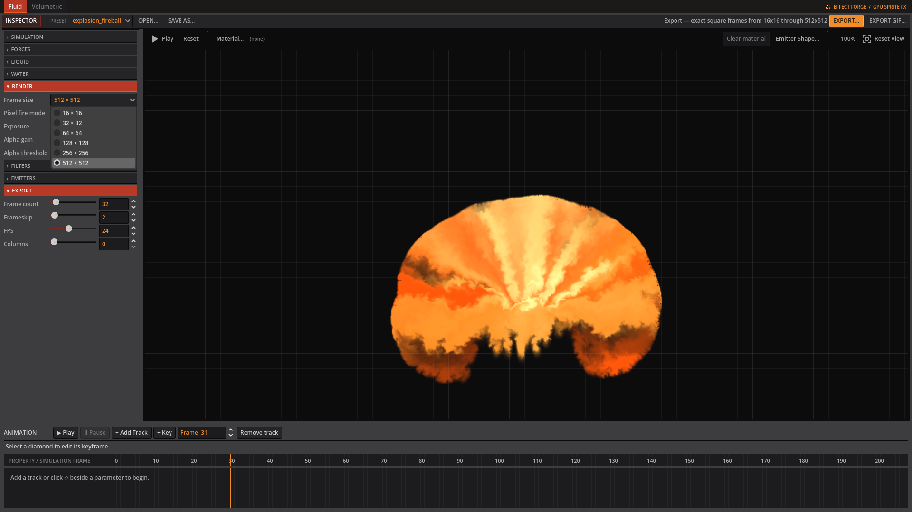
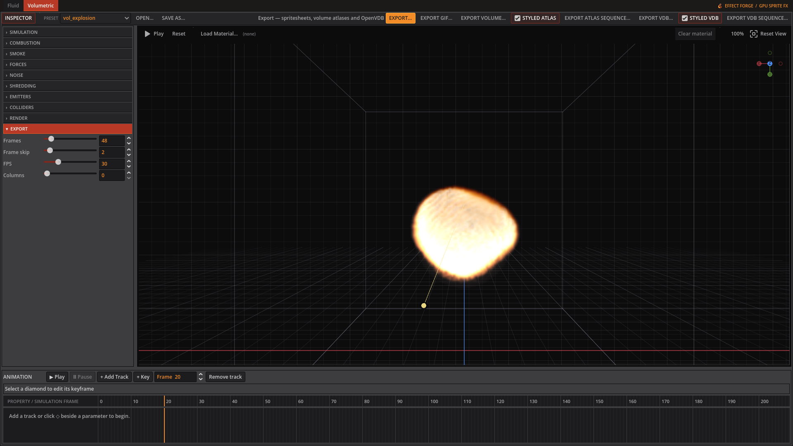

# Exporting

Set **Frames**, **Frame skip**, **FPS**, and **Columns** in the Volumetric Export tab, or their Fluid equivalents. Frame skip advances the simulation between captured frames; FPS is recorded for playback and does not change the simulation.

*Choose a fixed square frame size before exporting a Fluid spritesheet.*

## Choose an output

| Output | Use it for |
|---|---|
| **EXPORT...** | A PNG spritesheet of fixed size RGBA frames, with a sidecar JSON file. |
| **EXPORT GIF...** | An optimized animated GIF. |
| **EXPORT VOLUME...** | The simulated 3D volume as one tiled Z-slice atlas, in EXR or 8-bit PNG. EXR keeps the temperature range. |
| **EXPORT ATLAS SEQUENCE...** | One numbered atlas per configured export frame. |
| **EXPORT VDB...** | The current simulated volume as one OpenVDB file with `density` and `flames` grids. |
| **EXPORT VDB SEQUENCE...** | One numbered OpenVDB file per configured export frame. |

For an atlas, **STYLED ATLAS** bakes the preview's extinction, alpha cutoff and flame normalization into temperature and smoke. Turn it off for raw simulation fields. **STYLED VDB** does the corresponding bake into `density` and `flames`; off preserves raw simulation values. The two styled switches are on by default in the toolbar.

*The Export tab sets capture timing and layout; the toolbar offers the available output formats.*

## Toolbar reference

The following button text and available tooltips come from the workspace toolbar. A dash means no tooltip is set there.

| Control | Tooltip |
|---|---|
| INSPECTOR | Show or hide the parameter inspector |
| TIMELINE | Show or hide the effect timeline |
| OPEN... | Load a custom EffectForge JSON preset |
| SAVE AS... | — |
| EXPORT... | — |
| EXPORT GIF... | Export animation frames as an optimized GIF |
| EXPORT VOLUME... | Write the simulated volume as a tiled slice atlas a 3D engine can load as a 3D texture |
| STYLED ATLAS | Bake the preview's extinction, alpha cutoff, and flame normalization into atlas temperature and smoke. Disable for raw simulation fields. |
| EXPORT ATLAS SEQUENCE... | Write one numbered slice atlas per configured export frame |
| EXPORT VDB... | Write the current simulated smoke density as an OpenVDB FloatGrid |
| STYLED VDB | Bake the preview's extinction, alpha cutoff, and flame normalization into VDB density and flames. Disable for raw simulation fields. |
| EXPORT VDB SEQUENCE... | Write one numbered OpenVDB file per configured export frame |

## Reporting GPU problems

The app logs GPU adapter information and diagnostics to `user://logs/godot.log`, unless a different log file is requested. A typical Linux path is `~/.local/share/godot/app_userdata/effect-forge/logs/godot.log`; on Windows, look under `%APPDATA%\Godot\app_userdata\effect-forge\logs\godot.log`. The startup GPU line also prints the actual log path for that machine.

Include that log when reporting a GPU problem. A `NONFINITE` line means a simulation texture contains NaN or infinity values; the app then turns on detailed tracing for the rest of the session. A `SLOW` line means a GPU submission took more than 500 ms, close enough to the Windows driver reset threshold to warrant investigation.

For more detail from the start, launch the source app with `./scripts/run.sh -- --gpu-debug`. This logs individual dispatches and checks bound textures after each one, so it runs slowly. The same mode can be enabled with `EFFECT_FORGE_GPU_DEBUG=1`.

Godot's own engine option `--gpu-validation` enables Vulkan validation layers. It requires the Vulkan SDK on Windows or `vulkan-validation-layers` on Linux; launch the source app with `./scripts/run.sh --gpu-validation`, the Windows export with `effect-forge.exe --gpu-validation`, or the Linux export with `./effect-forge.x86_64 --gpu-validation` when you need engine-level diagnostics.
