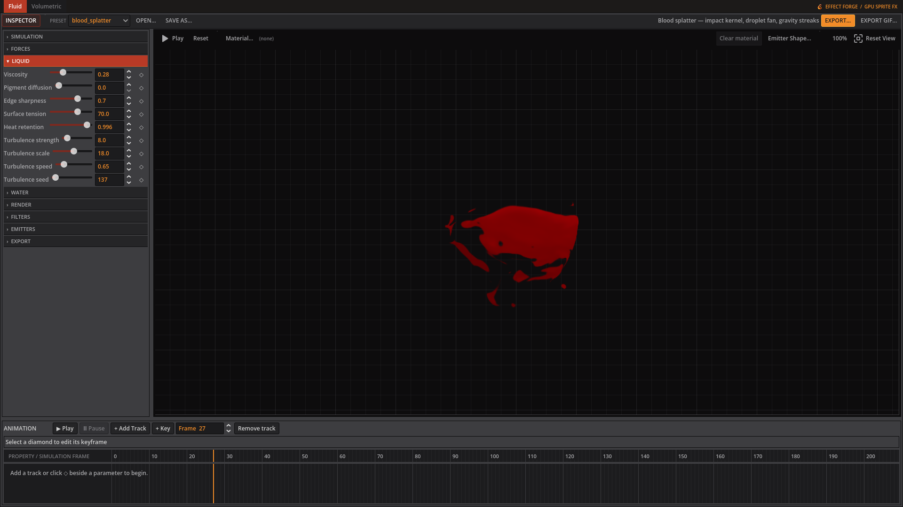
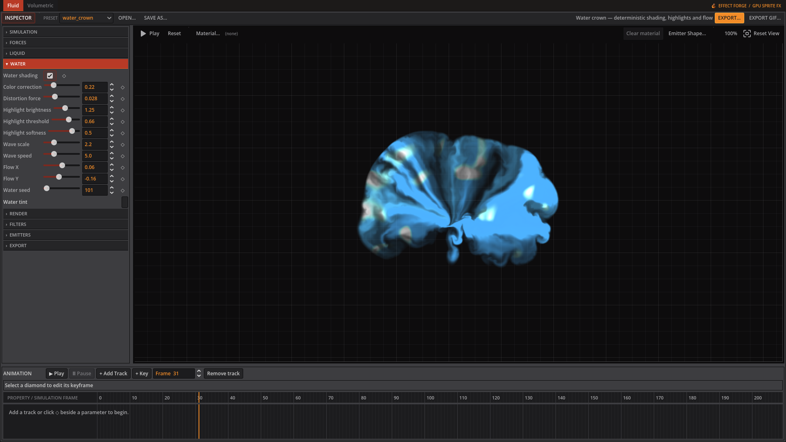
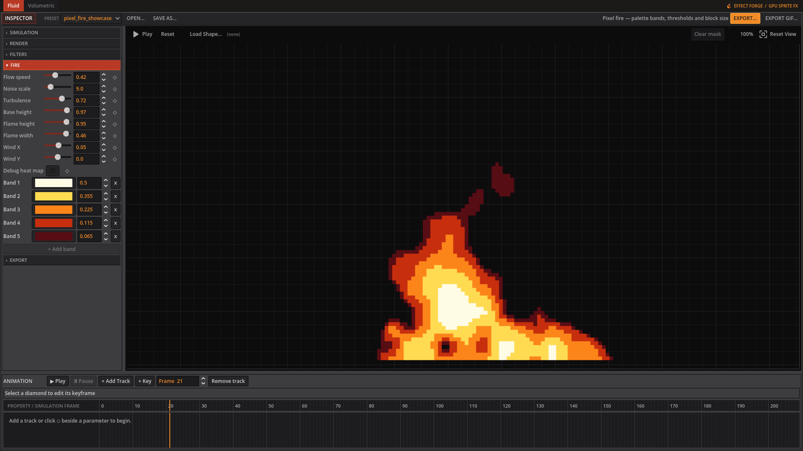

# Fluid

Choose a fluid preset to start. Controls appear according to render mode and the active Water or Lava setup; Pixel fire mode bypasses the fluid solver and shows the Fire controls.

## Simulation

| Control | Inspector hint |
|---|---|
| Grid size | Simulation resolution. Higher is more detailed but much slower, and reallocates GPU textures. |
| Timestep | Seconds of simulated time per frame. Larger moves fluid faster but is less stable. |
| Jacobi iterations | Pressure solver passes per frame. Higher holds the fluid together better; lower is faster. |
| Velocity dissipation | How much motion survives each frame. Below 1 the fluid gradually slows to a stop. |
| Dye dissipation | How much colour survives each frame. Lower makes the trail fade away sooner. |
| Vorticity | Re-injects the swirl a grid solver loses, adding curls and wisps. 0 is smooth, high is churning. |

## Forces

| Control | Inspector hint |
|---|---|
| Gravity X | Constant sideways force on the whole fluid, in cells per second squared. |
| Gravity Y | Constant vertical force. Positive pulls downward, since image +y is down. |
| Buoyancy | How strongly hot fluid rises. This is what drives fire and smoke upward. |
| Ambient temperature | The temperature buoyancy is measured against. Raise it and the same emitter rises less. |

## Liquid

*Liquid controls shape the blood splatter's flow and edges.*

| Control | Inspector hint |
|---|---|
| Viscosity | Smooths velocity into thicker, slower-moving flows. Raise it for syrup, slime, or honey. |
| Pigment diffusion | Spreads colour into neighbouring cells, softening narrow streaks and mixing the body of the liquid. |
| Edge sharpness | Restores contrast after pigment diffusion so the liquid keeps a readable silhouette. |
| Surface tension | Pulls curved density edges inward, encouraging rounded beads and cohesive blobs. |
| Heat retention | How much emitter heat survives each frame. It only changes motion when Temperature and Buoyancy are nonzero. |
| Turbulence strength | Adds deterministic curl-like motion to break up an overly smooth flow. |
| Turbulence scale | Controls the size of turbulent features. Low values make broad bends; high values make finer eddies. |
| Turbulence speed | Controls how quickly the seeded turbulence pattern evolves over simulation steps. |
| Turbulence seed | Selects a repeatable turbulence pattern without sacrificing deterministic exports. |

## Water

*Water shading adds tint and highlights to the crown splash.*

| Control | Inspector hint |
|---|---|
| Water shading | Apply deterministic animated water tint, distortion, and highlights to this fluid. |
| Color correction | Blend from emitter or material colour toward the global water tint. |
| Distortion force | Warp the highlight noise coordinates without changing the transparent silhouette. |
| Highlight brightness | Add white light to the brightest wave-noise regions. |
| Highlight threshold | Set how bright the procedural wave noise must be before it becomes a highlight. |
| Highlight softness | Control the transition width between the water body and bright wave highlights. |
| Wave scale | Set the spatial frequency of the procedural water pattern. |
| Wave speed | Advance the water pattern using fixed simulation time; zero freezes it. |
| Flow X | Move the highlight pattern horizontally in UV units. |
| Flow Y | Move the highlight pattern vertically in UV units. |
| Water seed | Select a repeatable procedural water pattern. |

## Lava

| Control | Inspector hint |
|---|---|
| Seamless flow | Loop lava from source A to destination B. Drag the handles in the preview. Disable for a simulated pour. |
| River width | Width of the flowing river as a fraction of the canvas. |
| Flow direction | Rotate the A-to-B channel around its midpoint. 0 moves right and 90 moves down. Shortens near canvas edges to keep both handles visible. |
| Edge curvature | 0 makes straight banks; 1 restores the curved river edges. Intermediate values soften the curves without changing the seamless loop. |
| Flow speed | Surface motion multiplier: 0 freezes crust and molten cells, 0.1 gives slow motion, 1 is normal. Fractional speeds smoothly blend the pattern to keep the loop seamless. |
| Lava shading | Enable the dedicated animated Voronoi renderer for the Lava preset. |
| Cell morph speed | Amount of cell-shape animation relative to surface travel. 0 keeps cell shapes fixed. Flow speed scales both travel and morphing; 0 freezes the whole surface. |
| Cell scale | Control the number and size of molten cells across the lava surface. |
| Cell sharpness | Tighten the transition between dark crust and hot molten cells. |
| Emission | Brighten hot cells to emulate emission in exported RGBA sprites. |

## Render

| Control | Inspector hint |
|---|---|
| Frame size | Square size of every preview and exported animation frame. |
| Pixel fire mode | Replace the fluid solver with the procedural pixel-fire generator. |
| Exposure | Multiplies output brightness before it is clamped. |
| Alpha gain | Multiplies opacity, so thin dye still reads. Raise it when the effect looks too faint. |
| Alpha threshold | Pixels fainter than this become fully transparent, cleaning up soft or noisy edges. |

## Filters

| Control | Inspector hint |
|---|---|
| Pixelate | Output block size in pixels. 1 is off; higher gives chunkier pixel art. |

## Emitters

This tab contains an editable list. See below.

## Fire

*Pixel fire mode shows its procedural flame controls and colour bands.*

| Control | Inspector hint |
|---|---|
| Flow speed | How far the flame pattern travels per loop, as a fraction of height. Lower is a slower flame. |
| Noise scale | Flame detail. Low gives broad tongues, high gives fine flickering. |
| Turbulence | Blends in a finer second layer of noise to break up the flow. |
| Base height | Where the flame's base sits, 0 at the top and 1 at the bottom edge. |
| Flame height | How far up the flame reaches before it fades out. |
| Flame width | Half-width of the flame at its base, as a fraction of the canvas. |
| Wind X | Bends the flame sideways, with the lean growing toward the tip. |
| Wind Y | Stretches the flame upward (negative) or presses it down (positive). |
| Debug heat map | Show the raw heat map instead of the palette. Useful for tuning the shape. |

## Export

| Control | Inspector hint |
|---|---|
| Frame count | Number of frames in the exported animation. |
| Frameskip | Simulation steps run per exported frame. Higher advances the sim further between frames. |
| FPS | Playback rate recorded in the exported sidecar JSON. |
| Columns | Columns in the exported sheet. 0 picks a near-square grid. |

### Fluid emitters

Add a source in **Emitters**, select it, and set its colour and injection controls. Drag its cross in the preview to move it. A shaped kernel can replace the default soft round source.

| Control | Editor hint |
|---|---|
| Position X | Where the emitter sits across the canvas, 0-1. Drag its cross in the preview to move it. |
| Position Y | Where the emitter sits down the canvas, 0-1. Drag its cross in the preview to move it. |
| Radius | Size of the blob injected each frame, as a fraction of the canvas. |
| Temperature | How hot the injected fluid is. Buoyancy makes hotter fluid rise faster. |
| Density | How much fluid is injected each frame. This is what drives the opacity of the effect. |
| Scale X | Stretches or compresses the injected shape horizontally before rotation. |
| Scale Y | Stretches or compresses the injected shape vertically before rotation. |
| Rotation | Rotates the Gaussian or selected shape kernel in degrees. |
| Falloff | Profile exponent. Below 1 spreads soft edges; above 1 tightens them. |
| Impulse X | A sideways push given to the fluid as it is injected, for angling the jet. |
| Impulse Y | A vertical push given to the fluid as it is injected. Negative aims upward. |
| Radial impulse | Pushes outward from the emitter; negative values pull inward for implosions. |
| Start frame | First frame this emitter injects on. |
| End frame | -1 means the emitter never stops |
| Pulse period | Frames per emission cycle. 0 keeps the source continuously active. |
| Pulse duty | Fraction of each pulse cycle that injects fluid. |
| Pulse phase | Offsets this emitter within its pulse cycle, useful for alternating sources. |

The **Water** controls shade a fluid with animated tint, distortion and highlights. **Lava** controls a flowing river between draggable A/B endpoints or a simulated pour. **Fire** controls the procedural pixel-fire generator; its palette editor provides the colour bands and thresholds.
