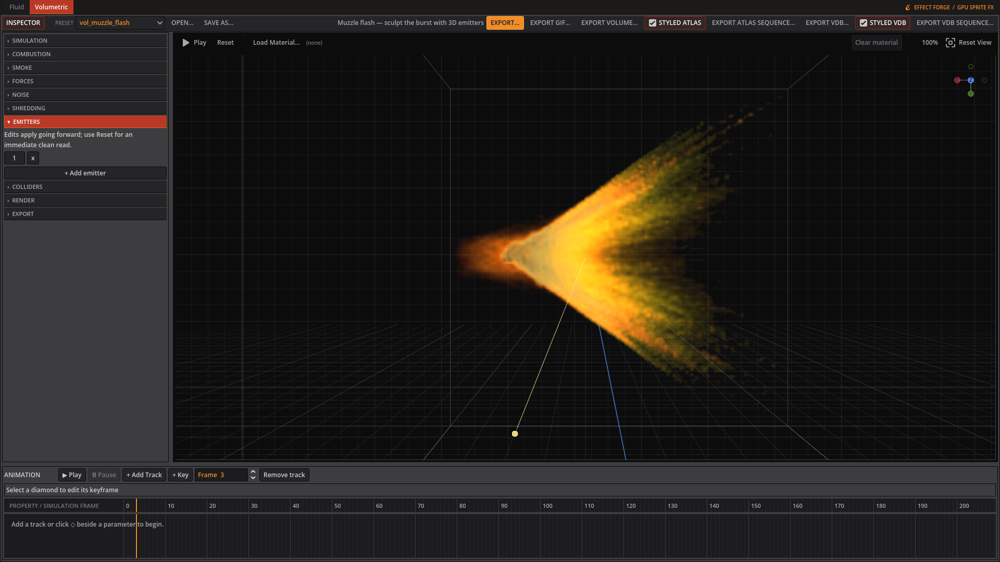

# EffectForge

Create animated effects, preview them live, and export them to your game. **Fluid** makes 2D fire, smoke, liquids, and procedural pixel fire. **Volumetric** simulates 3D fire, smoke, explosions, and weapon bursts, then exports camera views as sprites or the simulation as a volume.

[Download the beta on itch.io](https://avskum.itch.io/effectforge){: .btn .btn-primary }
[Getting started]({{ '/getting-started.html' | relative_url }}){: .btn }

Explore [Fluid]({{ '/fluid.html' | relative_url }}), [Volumetric]({{ '/volumetric.html' | relative_url }}), and [Exporting]({{ '/exporting.html' | relative_url }}) for the controls and workflow. Sprite FX is temporarily hidden in the current beta.

## See the effects in motion

These GIFs are actual EffectForge exports. Start from a preset, change the controls, and export your own variation.

### Volumetric fire and explosions

Shape the burst with 3D emitters, fuel, blast pressure, curl noise, and lighting. Export a PNG spritesheet, GIF, volume atlas, or OpenVDB sequence. [Explore Volumetric]({{ '/volumetric.html' | relative_url }}).

### Weapon bursts

The weapon presets include rifle and handgun muzzle flashes, a repeating machine-gun flash, and rocket backblast with sparks.

### Stylized water

Tune the water tint, distortion, highlights, and emission timing. Fluid also includes blood, dust, smoke, slime, honey, and lava presets. [Explore Fluid]({{ '/fluid.html' | relative_url }}).

### Pixel-art fire

Build a looping flame with editable palette bands, source shapes, and pixel scale, then export it as a spritesheet or GIF.

## October 8 beta update

The update adds weapon effects, more emitter shapes, richer fire and smoke shading, render-time detail, sharper previews, and undo/redo. [Getting started]({{ '/getting-started.html' | relative_url }}) explains navigation and shortcuts; [Exporting]({{ '/exporting.html' | relative_url }}) covers formats and GPU problem reports.

Windows and Linux downloads are available. A Vulkan-capable GPU is required. Native Windows testing is still needed; GIF export requires ImageMagick.
