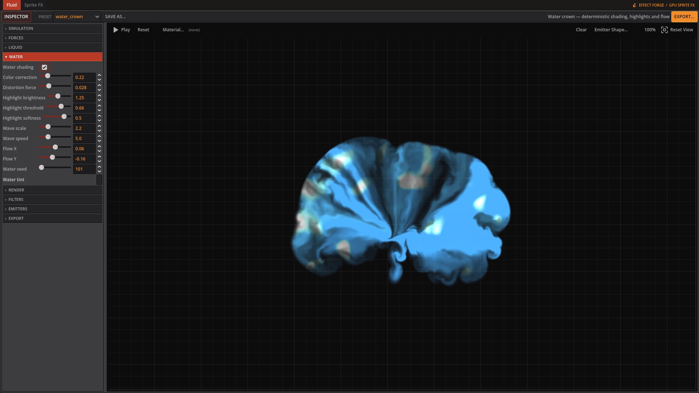
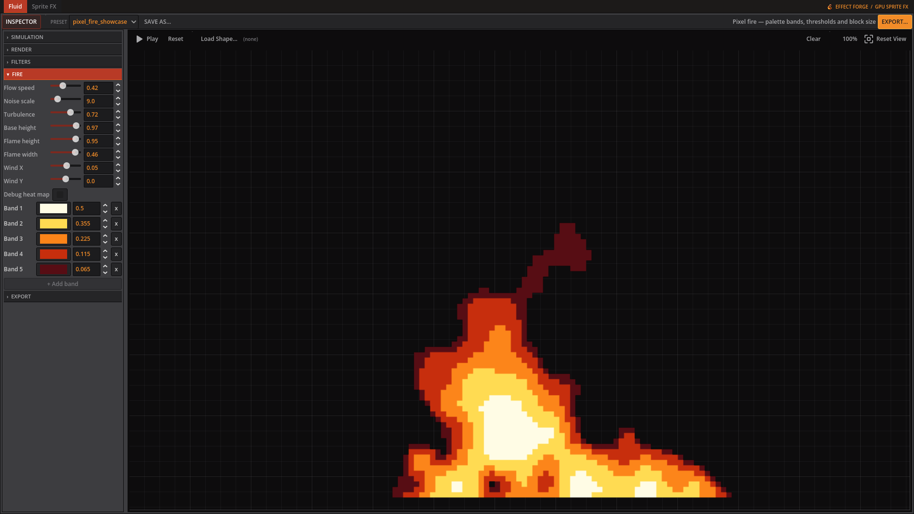
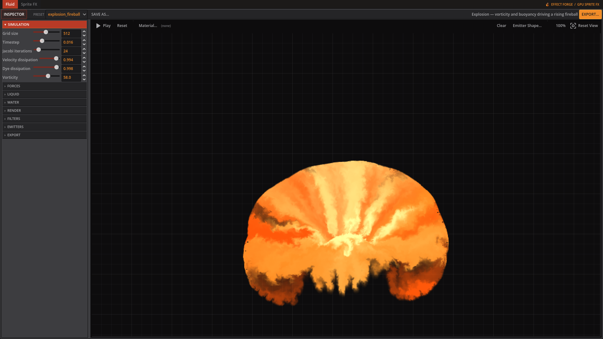
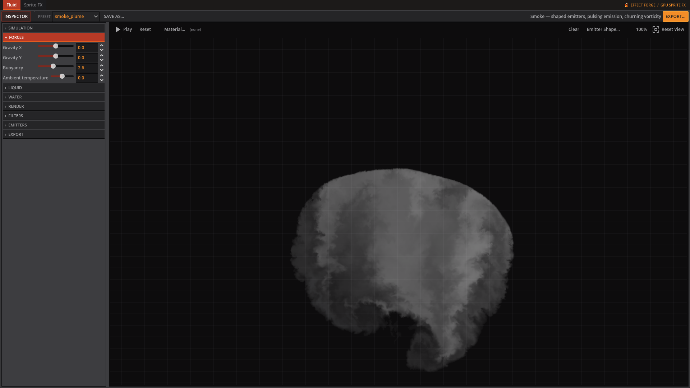

# Effect Forge

Effect Forge is a Godot 4 sprite effect generator. **Fluid** makes 2D liquid and fire effects, including procedural pixel fire. **Volumetric** simulates 3D fire, smoke and explosions, then renders them as 2D sprites or exports the volume. **Sprite FX** is coming soon in the workspace.

Start with [Getting started](getting-started.md), then explore [Fluid](fluid.md), [Volumetric](volumetric.md), and [Exporting](exporting.md).

## A quick visual tour

Fluid can make water splashes; the Water tab controls its tint, distortion and highlights.

Pixel fire has its own shape controls and editable colour bands.

Volumetric emitters, combustion and rendering shape an explosion.

The Smoke tab controls the plume's lifetime, colour, density and lighting response.
