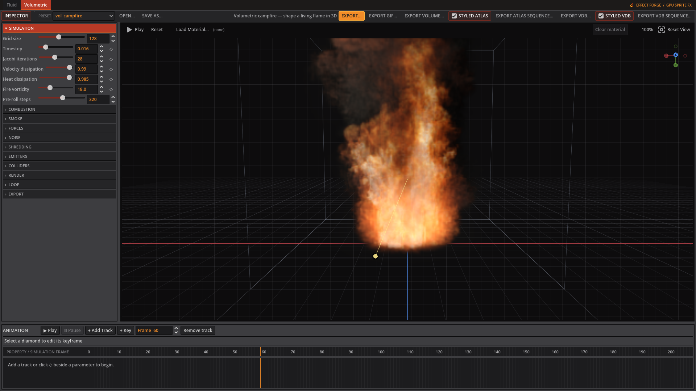
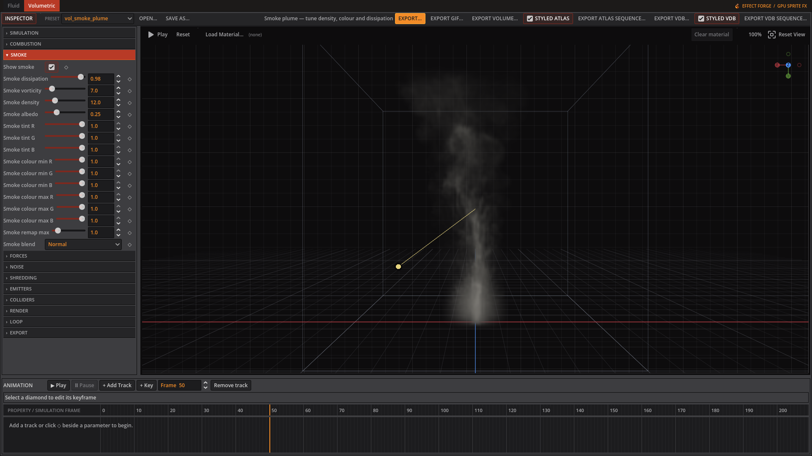
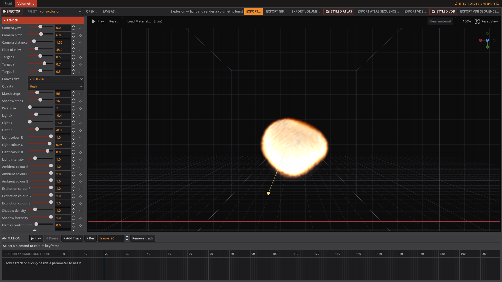
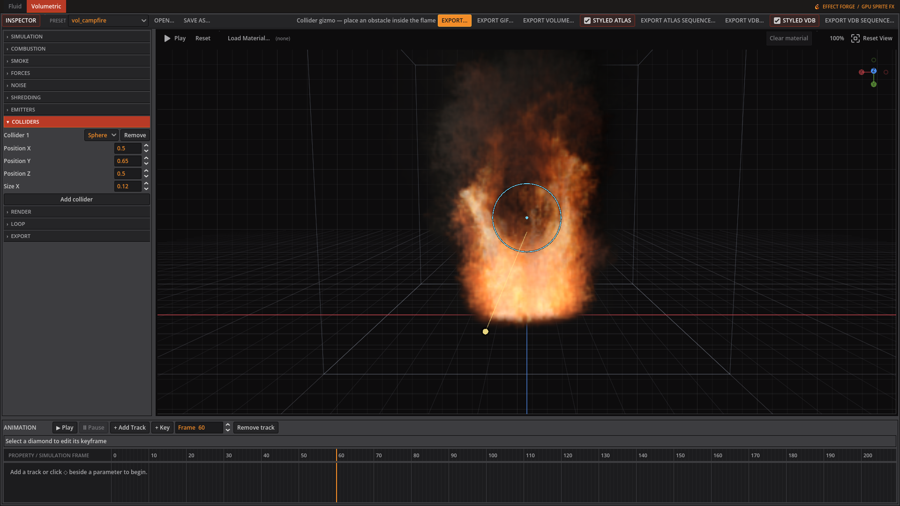
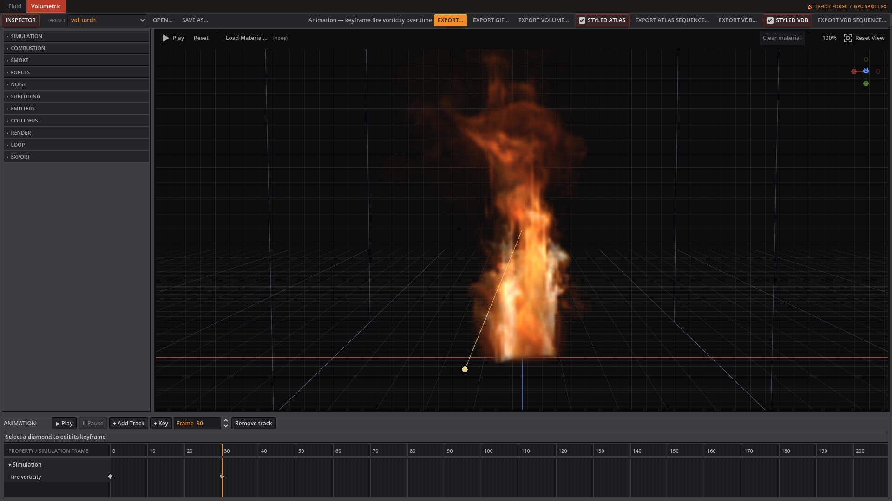

# Volumetric

Open a `vol_*.json` preset or choose one in the toolbar. Inspector controls appear only when they affect the current setup; for example, disabled Noise and Shredding passes hide their detail controls.

*The Volumetric workspace shows Simulation controls beside the preview, with animation tracks below.*

## Volumetric examples in motion

*Explosion: shape the blast, combustion, smoke, and lighting.*

*Rifle muzzle flash: the weapon presets also include handgun, repeating machine-gun, and rocket effects.*

*Campfire: tune a continuous flame with fuel, temperature, vorticity, and fire-color gradients.*

*Smoke plume: tune density, dissipation, color, and lighting independently from fire.*

## Simulation

| Control | Inspector hint |
|---|---|
| Grid size | Voxels per axis. Cost grows with the cube, and this reallocates GPU textures. |
| Timestep | Seconds of simulated time per frame. Larger moves fluid faster but is less stable. |
| Jacobi iterations | Pressure solver passes per frame. Higher holds the gas together better; lower is faster. |
| Velocity dissipation | How much motion survives each frame. Below 1 the gas gradually slows. |
| Heat dissipation | How fast heat bleeds away. Lower makes flames shorter. |
| Fire vorticity | Swirl in hot, burning gas. This is what gives fire its curl. |
| Pre-roll steps | Steps simulated before the first captured frame, so a continuous effect is already burning when the sheet starts instead of showing its own ignition. Leave at 0 for a burst, which wants its beginning. |

## Combustion

| Control | Inspector hint |
|---|---|
| Ignition temperature | How hot a cell must be before its fuel starts burning. |
| Burn rate | Fraction of remaining fuel consumed per second once lit. |
| Heat release | Temperature produced per unit of fuel burned. Drives flame brightness and lift. |
| Cooling rate | How fast a cell falls back toward ambient temperature. |
| Gas expansion | How hard burning gas pushes outward. This is what makes an explosion blow rather than glow. |

## Smoke

*The Smoke tab controls the plume's persistence, colour, and light scattering.*

| Control | Inspector hint |
|---|---|
| Show smoke | Hide the smoke to keep only the fire. Styled exports follow; raw exports keep the simulated smoke. |
| Smoke dissipation | How long smoke lingers. Lower clears the plume sooner. |
| Smoke vorticity | Swirl in cooled smoke. Usually lower than fire, or the plume looks noisy. |
| Smoke yield | Smoke produced per unit of fuel burned. Zero gives a clean flame. |
| Smoke density | How quickly smoke blocks light. Higher is denser and more opaque. |
| Smoke albedo | How much light smoke scatters back. Higher reads as steam, lower as soot. |
| Smoke tint R | Colour of the smoke itself, multiplied into the scattering albedo. White is neutral. |
| Smoke tint G | Colour of the smoke itself, multiplied into the scattering albedo. White is neutral. |
| Smoke tint B | Colour of the smoke itself, multiplied into the scattering albedo. White is neutral. |
| Smoke colour min R | Smoke colour at zero density; white leaves scattering unchanged. |
| Smoke colour min G | Smoke colour at zero density; white leaves scattering unchanged. |
| Smoke colour min B | Smoke colour at zero density; white leaves scattering unchanged. |
| Smoke colour max R | Smoke colour at the remap maximum; white leaves scattering unchanged. |
| Smoke colour max G | Smoke colour at the remap maximum; white leaves scattering unchanged. |
| Smoke colour max B | Smoke colour at the remap maximum; white leaves scattering unchanged. |
| Smoke remap max | Smoke density that reaches the maximum smoke colour. |
| Smoke blend | How smoke colour combines with fire colour where both are present. Smoke away from the flame is unaffected by this. |

## Forces

| Control | Inspector hint |
|---|---|
| Buoyancy | How strongly hot gas rises. |
| Ambient temperature | The temperature gas cools toward, and the level buoyancy measures against. |
| Gravity X | Constant acceleration along X. |
| Gravity Y | Constant acceleration along Y. Positive is downward on screen. |
| Gravity Z | Constant acceleration along Z. |
| Wind X | Steady drift along X. |
| Wind Y | Steady drift along Y. |
| Wind Z | Steady drift along Z. |

## Noise

| Control | Inspector hint |
|---|---|
| Noise amplitude | Strength of the curl-noise force. This is what breaks a burst out of a smooth sphere — the solver has no other way to create swirl from a symmetric start. Zero disables the pass entirely. |
| Noise scale | Noise periods across the domain. Higher is finer detail. Note this is relative to the whole domain, not to the effect, so a small effect needs a high value. |
| Octaves | Layers of noise at successively finer scales. More octaves is more detail and proportionally more cost per voxel. |
| Lacunarity | How much finer each octave is than the last. |
| Gain | How much each successive octave contributes. Lower keeps the large scales dominant. |
| Animation speed | How fast the noise field drifts. Driven by simulated time, so it stays deterministic. |
| Temperature mask | How strongly the force follows temperature. At 1 only hot cells are stirred; at 0 temperature is ignored. |
| Smoke mask | How strongly the force follows smoke. At 1 empty air is left still, which is usually what you want. |
| Temp range min | Temperature that maps to no amplification. In this solver's units, which are of order 1-10, NOT Kelvin. |
| Temp range max | Temperature that maps to full amplification. Set this near the hot end your sim actually reaches; too high and the mask throttles the force to nothing. |
| Smoke range min | Smoke density that maps to no amplification. |
| Smoke range max | Smoke density that maps to full amplification. Same caution as the temperature range: set it to the density your sim reaches. |

## Shredding

| Control | Inspector hint |
|---|---|
| Shred intensity | Tears the flame front into filaments. Zero disables the pass. Off in the EmberGen reference explosion, so treat it as a flourish rather than the thing that makes fire look right. |
| Temperature threshold | The temperature shredding acts at. Set it where your flame front sits. |
| Threshold width | How far either side of the threshold shredding reaches. Wider affects more of the plume, narrower only its boundary. |

## Emitters

This tab contains an editable list. See below.

## Colliders

This tab contains an editable list. See below.

## Render

*The Render tab adjusts the camera, lighting, and appearance of the explosion preview.*

| Control | Inspector hint |
|---|---|
| Camera yaw | Orbit angle around the domain. |
| Camera pitch | Orbit elevation. |
| Camera distance | How far the camera sits from the target. The domain is a unit cube. |
| Field of view | Vertical field of view in degrees. |
| Target X | Point the camera looks at. |
| Target Y | Point the camera looks at. |
| Target Z | Point the camera looks at. |
| Canvas size | Rendered frame size in pixels. Also the exported cell size. |
| Quality | Preset march and shadow step counts. It writes the two sliders below rather than overriding them, so it reads back as Custom whenever they are set by hand. |
| March steps | Samples along each camera ray. Higher is smoother and slower. |
| Shadow steps | Samples in the secondary march toward the light. Zero disables self-shadowing. |
| Pixel size | Retro output: quantises the frame into blocks this many pixels across. 1 is off. Also renders that much faster, since one ray is marched per block. |
| Light X | Direction the light travels. |
| Light Y | Direction the light travels. |
| Light Z | Direction the light travels. Drag the light gizmo in the preview instead of these three, if you just want to aim it. |
| Light colour R | Colour of the light itself, independent of the smoke it's lighting. |
| Light colour G | Colour of the light itself, independent of the smoke it's lighting. |
| Light colour B | Colour of the light itself, independent of the smoke it's lighting. |
| Light intensity | Brightness of the light itself. Separate from Exposure, which scales the whole rendered image afterward. |
| Ambient colour R | Tint of the ambient illumination floor; white is neutral. |
| Ambient colour G | Tint of the ambient illumination floor; white is neutral. |
| Ambient colour B | Tint of the ambient illumination floor; white is neutral. |
| Extinction colour R | Per-channel light absorption through smoke; white absorbs equally. |
| Extinction colour G | Per-channel light absorption through smoke; white absorbs equally. |
| Extinction colour B | Per-channel light absorption through smoke; white absorbs equally. |
| Shadow density | Scales smoke optical depth toward the light; zero removes smoke shadows. |
| Shadow intensity | Mix between unshadowed and fully shadowed lighting. |
| Flames contribution | Adds nearby flame colour to lit smoke; zero disables local flame scattering. |
| Scattering radius | Distance in volume coordinates used to sample nearby flame heat. |
| Emission gain | How brightly hot gas glows. This is the flame itself. |
| Scattering anisotropy | Direction smoke scatters light. 0 scatters equally in all directions. Positive brightens smoke seen toward the light; negative favours light behind the viewer. |
| Exposure | Overall brightness multiplier applied after marching. |
| Alpha gain | Scales the exported sprite's opacity. |
| Alpha threshold | Pixels fainter than this are cut away entirely, keeping edges clean. |
| Flame temp min | Temperature mapped to the cold end of the fire gradient. In this solver's units, of order 1-10 — NOT Kelvin, despite EmberGen quoting 1200 K for the same control. |
| Flame temp max | Temperature mapped to the hot end. Set it near the peak your sim reaches: too high and everything sits at the cold end and renders as smoke rather than fire. |
| Flame shaping | How much flames add to opacity as well as brightness. Without it a bright fireball carrying little smoke reads as a glow rather than a body. |
| Smoke sharpening | Suppresses thin smoke while keeping dense areas opaque; zero leaves smoke unchanged. |
| Flames sharpening | Concentrates flame opacity toward the hottest areas; zero leaves the flame shape unchanged. |
| Flame remap ramp | Curves temperature within the fire colour window; one keeps the existing gradient mapping. |
| Motion blur | Volume Processing: smears matter along its velocity before rendering; zero disables the pass. |

## Loop

| Control | Inspector hint |
|---|---|
| Seamless loop | Cross-fades the end of the animation back over its beginning so the sheet tiles. |
| Blend frames | How many frames the cross-fade spans. Longer is smoother but blurs more of the loop. |

## Export

| Control | Inspector hint |
|---|---|
| Frames | How many frames land in the sheet. |
| Frame skip | Simulation steps per captured frame. Higher covers more motion per frame. |
| FPS | Playback rate recorded in the sidecar. Does not affect the simulation. |
| Columns | Sheet width in cells. Zero picks a near-square layout. |

### Emitter controls

The **Emitters** list edits each source independently. Shape choices in the current source are sphere, box, cylinder, capsule, cone, torus, ellipsoid, hemisphere, rounded box, tube, rounded cylinder and rounded cone. The local Y axis defines elongated shapes; Rotation X/Y/Z aim them. Burst injects for Burst duration, and Burst repeat can fire it again after a chosen number of frames. Particles switches from a normal volume deposit to GPU particles when greater than zero.

| Control | Editor hint |
|---|---|
| Position X | Where the emitter sits across the unit volume, 0-1. |
| Position Y | Where the emitter sits down the unit volume, 0-1. |
| Position Z | Where the emitter sits in depth, 0-1. |
| Radius | Radius of the injected sphere, or half-extent of the injected box. |
| Shape | Primitive volume used to inject material; Y is its local axis. |
| Height | Full length along the shape's local Y axis, in domain units. |
| Radius 2 | Minor radius for torus, wall thickness for tube, or edge rounding; zero uses the shape default. |
| Rotation X | Degrees around X; 90 degrees aims a cylinder along Z. |
| Rotation Y | Degrees around Y, applied after X. |
| Rotation Z | Degrees around Z, applied after X and Y. |
| Impulse X | Initial velocity injected along X, in cells per second. |
| Impulse Y | Initial velocity injected along Y. Negative rises on screen. |
| Impulse Z | Initial velocity injected along Z, in cells per second. |
| Fuel | Fuel deposited per step. It burns once the temperature reaches ignition. |
| Temperature | Heat deposited per step. This solver uses simulation units, not Kelvin. |
| Smoke | Smoke deposited per step, before combustion adds any yield. |
| Start frame | First simulation frame this emitter injects on. |
| End frame | Last active frame; -1 keeps a continuous source active. |
| Burst | Emit for Burst duration only, for a one-shot explosion. |
| Burst duration | Seconds over which a burst injects its total material. |
| Burst repeat (frames) | Re-fire the burst every N frames; 0 fires once. Makes a loopable firing cycle. |
| Particles | GPU particles fired per burst. Zero uses the usual volume deposit; all emitters share a 65,536 particle pool. |
| Life (s) | Seconds each particle carries heat and smoke. |
| Direction jitter | Random direction strength relative to the emitter impulse. |
| Speed random | Random fractional change in each particle's launch speed. |
| Drag | Velocity multiplier per simulation step; 1 keeps speed constant. |
| Heat | Temperature deposited at every sampled point of the particle path. |
| Smoke | Smoke deposited at every sampled point of the particle path. |
| Pressure rate | Outward blast pressure added by this emitter. Zero disables it. |
| Random intensity | How much deterministic variation breaks up the blast front. |
| Random scale | Spatial scale of the deterministic pressure variation. |

### Collider controls

The **Colliders** list selects and edits analytic colliders. In the preview, drag the circle's centre or inside the outline to move it in the camera plane; its depth stays fixed during the drag. See the collider list for type, position and size.

*Drag the circle's centre or inside its outline to reposition the sphere collider.*

### Fire colour and keyframes

The fire gradient editor lets you add or remove stops and change each stop's position and colour. **Flame temp min/max** map simulated temperature across that gradient. The small diamond beside an animatable inspector row adds a key at the current frame; a filled diamond marks a key there. The timeline's **+ Add Track**, **+ Key**, and key diamonds let you edit the curve. Reset and replay when changing simulation history.

*The Fire vorticity track shows keyed values beneath the torch preview.*

## Making a muzzle flash

*The Emitters tab shows the source settings for this muzzle-flash preset.*

1. Load `vol_muzzle_flash.json` from the bundled presets. It uses a one-shot Burst lasting 0.016 seconds and 20,000 particles. Particle jitter and impulse spread hot material into streaks instead of a smooth deposited blob.
2. Keep **Smoke albedo** at 0.0. This leaves the smoke unlit, so the short flame dominates the flash. **Flame temp min/max** are 0.5 and 3.0 in this preset: they place the solver's heat within the gradient rather than treating it as Kelvin.
3. **Flames sharpening** (1.5) concentrates the hot shape; **Smoke sharpening** (1.0) cuts thin haze. **Motion blur** (1.5) smears matter along its velocity before rendering and lengthens the fast streaks.
4. Compare `vol_muzzle_handgun.json` and `vol_muzzle_machinegun.json`. The latter sets Burst repeat to 4 frames for a repeating firing cycle; the single flash uses 0.
